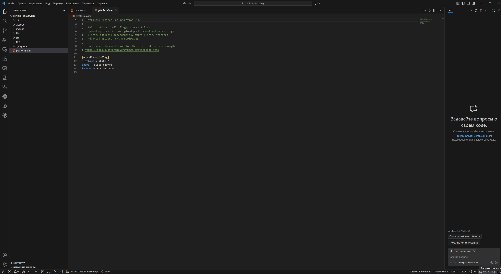
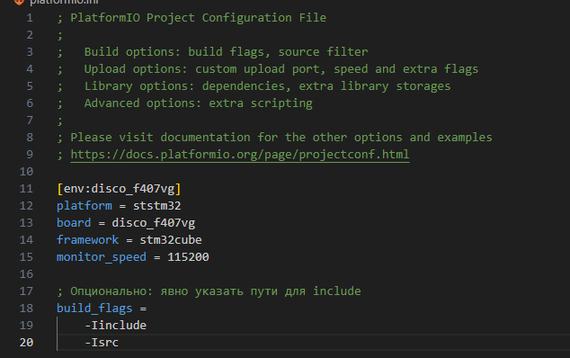
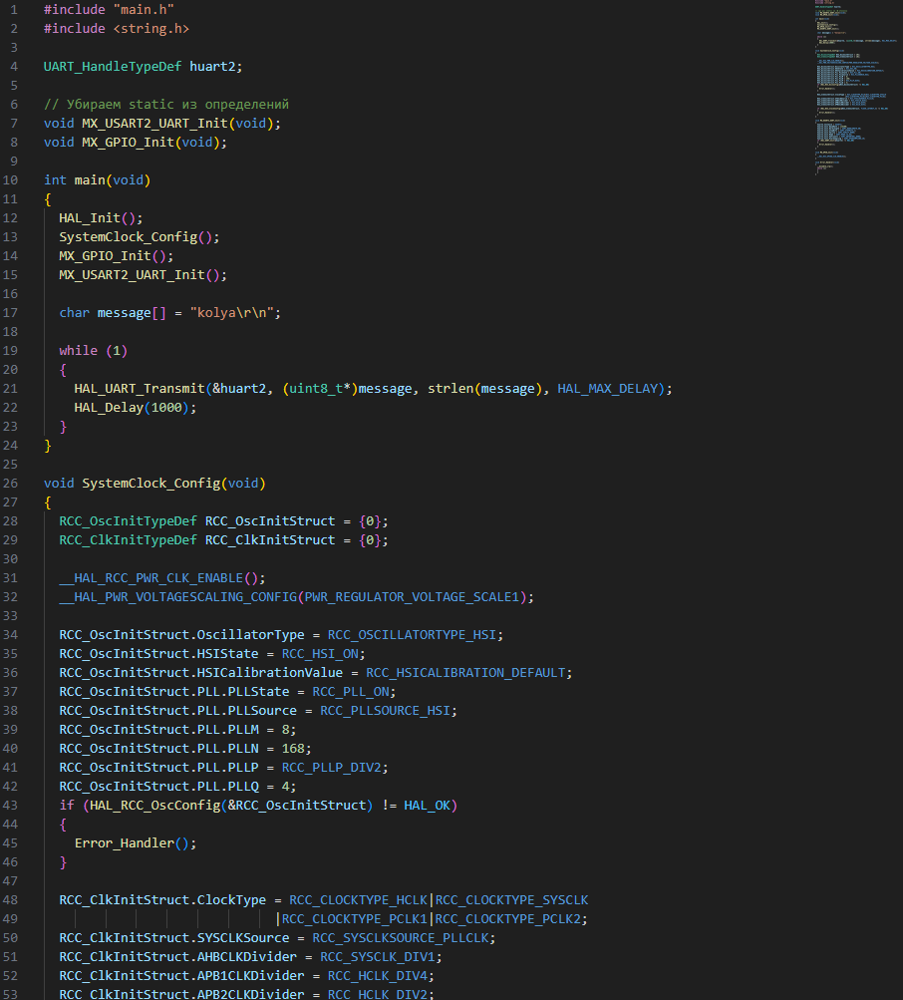
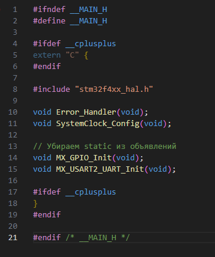

# Создание и последующий тест прошивки для STM32f4 #
# 1. Был создан проект в PlatformIO

# 2. Редактирование platform.ini и написание прошивки с выводом текста на USART2
* platform.ini

* main.c

* main.h

* Была произведена сборка посредством нажатия кнопки Build
# 3.Тест

        1) mach create - Создает виртуальный микрочип 
        2) machine LoadPlatformDescription @platforms/boards/stm32f4_discovery-kit.repl - Загрузка готовой конфигуразии из папки ".../Renode/platforms/boards"
        3) sysbus LoadELF ".../firmware.elf" - Загрузка написанной прошивки
        4) showAnalyzer sysbus.usart2 - Показ usart2, куда выводится текст
        4) s (Он же start) - Старт эмуляции
        
